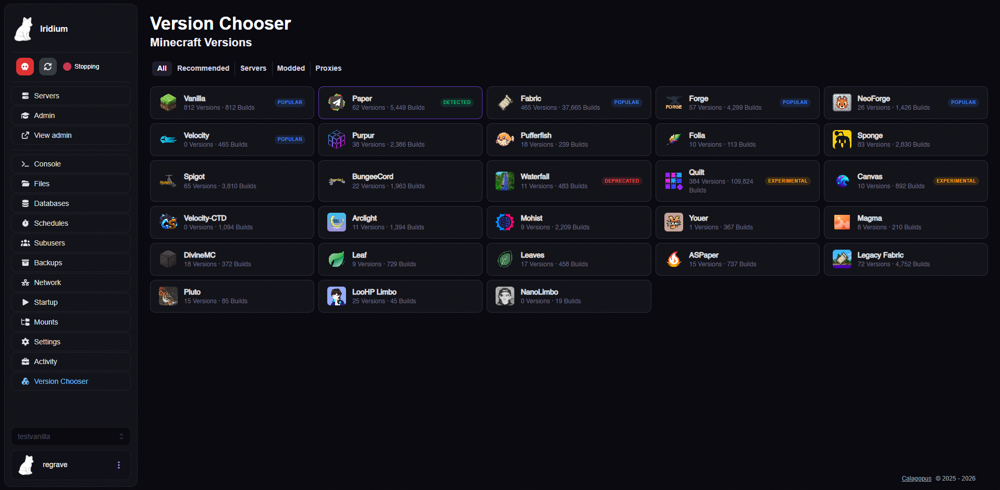
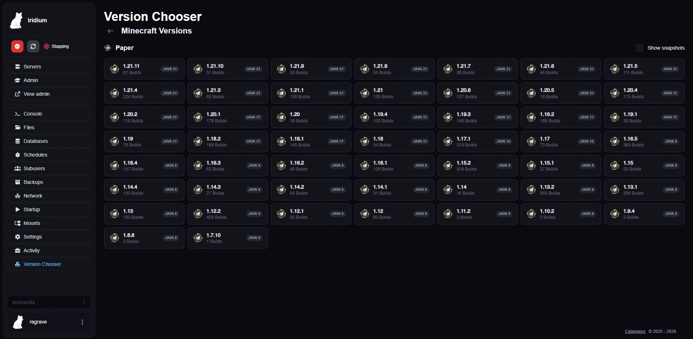
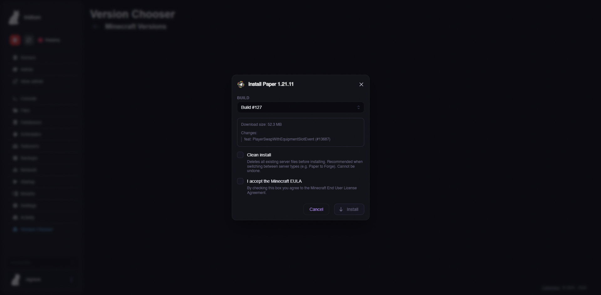
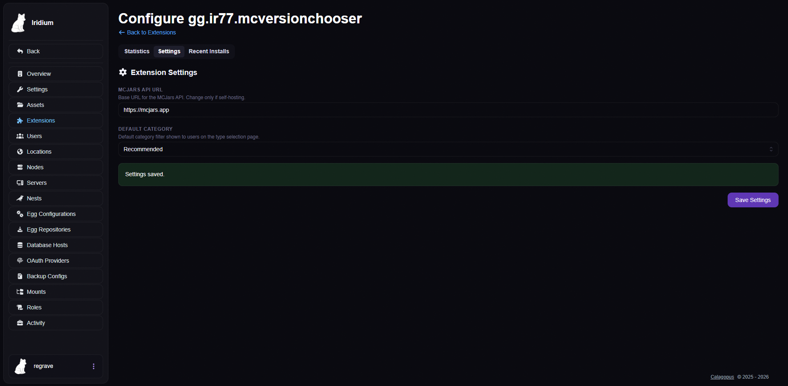

# MC Version Chooser

A [Calagopus Panel](https://github.com/calagopus/panel) extension that lets users switch Minecraft server versions directly from the panel UI.

## Screenshots

### Type Selection
Browse all available server types with category filters. Auto-detects your current server type.



### Version Selection
Pick a Minecraft version with Java requirement indicators and a snapshot toggle.



### Install Modal
Select a specific build, toggle clean install, and accept the EULA before installing.



### Admin Configuration
Configure the MCJars API URL and default category filter from the admin panel.



## Features

### User-Facing
- Browse all server types from the [MCJars](https://mcjars.app) API (Paper, Purpur, Fabric, Forge, etc.)
- Category filters: All, Recommended, Servers, Modded, Proxies
- Auto-detects current server type from egg name and startup command
- Version grid with snapshot toggle and Java version indicators
- Build selector with changelogs and download sizes
- Clean install option (wipes all files before installing)
- Zip-based installs for modded servers (Forge, NeoForge)
- Real-time download progress tracking
- Automatically stops the server before installing a new version
- Writes `.mcvc-type.json` marker file on install — used by other extensions (like the Content Installer) to reliably detect the current server type without guessing from egg names or leftover files

### Admin Panel
- Extension configuration page with customizable MCJars API URL
- Installation statistics with doughnut charts (type distribution, success/failure rates)
- Summary cards: total installs, success rate, clean installs, unique servers
- Recent installations table with server, type, version, and status
- Configurable default category filter

## Architecture

```
├── Metadata.toml          # Extension metadata
├── backend/
│   └── src/lib.rs         # Rust backend - Wings API proxy + admin endpoints
├── frontend/
│   └── src/
│       ├── index.ts       # Extension entry point + route registration
│       ├── api.ts         # MCJars API client + type detection
│       ├── VersionChooserPage.tsx  # Main 3-step version chooser UI
│       ├── AdminConfigPage.tsx     # Admin config + stats dashboard
│       └── app.css        # Styling
└── migrations/
    └── 20260401000000_create_mcvc_installs/  # Install tracking table
```

## Backend API Routes

### Client (per-server)
- `POST /api/client/servers/{uuid}/mc-version-chooser/install` - Install a server version
- `GET /api/client/servers/{uuid}/mc-version-chooser/install/status` - Check download progress

### Admin
- `GET /api/admin/mc-version-chooser/stats` - Installation statistics
- `GET /api/admin/mc-version-chooser/settings` - Get extension settings
- `POST /api/admin/mc-version-chooser/settings` - Update extension settings
- `GET /api/admin/mc-version-chooser/installs` - Recent installation log

## Security

- All client routes require `files.create` permission
- Admin routes are protected by admin authentication middleware
- Download URLs are validated against a whitelist of trusted domains (mcjars.app, papermc.io, mojang.com, etc.)
- All file operations go through the Wings API (no direct server access)

## Installation

1. Download the latest `.c7s.zip` from [Releases](https://github.com/Regrave/mc-version-chooser/releases)
2. Upload it to your panel's extensions directory
3. Trigger a panel rebuild
4. The `mcvc_installs` table will be created automatically on startup

## License

MIT
